<div align="center">

> ⚠️ **Alpha 内测版本警告**：此为早期内部构建版本，尚不完整且可能存在错误。欢迎大家提 [Issue](https://github.com/datawhalechina/vibe-blog/issues) 反馈问题或建议。


_Turn complex tech into stories everyone can understand._

**中文 | [English](README_EN.md)**

<p>

[](https://github.com/datawhalechina/vibe-blog)


<h1>vibe-blog 【!Alpha内测版】</h1>
</p>

<b>一个基于多 Agent 架构的 AI 长文博客生成Agent，支持深度调研、智能配图、Mermaid 图表、代码集成，<br></b>
<b>将技术知识转化为通俗易懂的科普文章，让每个人都能轻松理解复杂技术</b>

<b>🎯 降低技术写作门槛，让知识传播更简单</b>

<br>

_如果该项目对你有用, 欢迎 star🌟 & fork🍴_

<br>

</div>

---

📝 **更新日志**：查看 [CHANGELOG.md](./CHANGELOG.md) 了解完整版本历史。

---

<br>

# 项目简介

**一天时间，一本大模型技术教程，40+万字。**

我用一天时间完成了 [《Hello LLM-FineTuning》](https://lailoo.github.io/Hello-LLM-FineTuning) —— 一本大模型微调技术教程，共 **15+章**、**40+万字**、**100+ 精美配图**。嗯？我在吹牛，可以[点进去](https://lailoo.github.io/Hello-LLM-FineTuning)阅读下。

**秘密武器是 vibe-blog** —— 一款专为技术写作打造的「长文技术博客生成 Agent」。它帮我自动化的完成了从素材收集 → 深度调研 → 大纲规划 → 内容撰写 → 代码集成 → 智能配图 → 质量审核 → 专业排版的**写作全流程**工作。如果你也有很多想法和创意，却苦于没有时间和精力去落地，不妨试试 **vibe-blog** 😊

> 让长文技术写作变得简单，让知识传播更高效。

<table>
<tr>
<th>长度</th>
<th>预览</th>
<th>章节数</th>
<th style="min-width:150px">博客长度</th>
<th>示例文章</th>
</tr>
<tr>
<td>📄 <b>短文</b></td>
<td>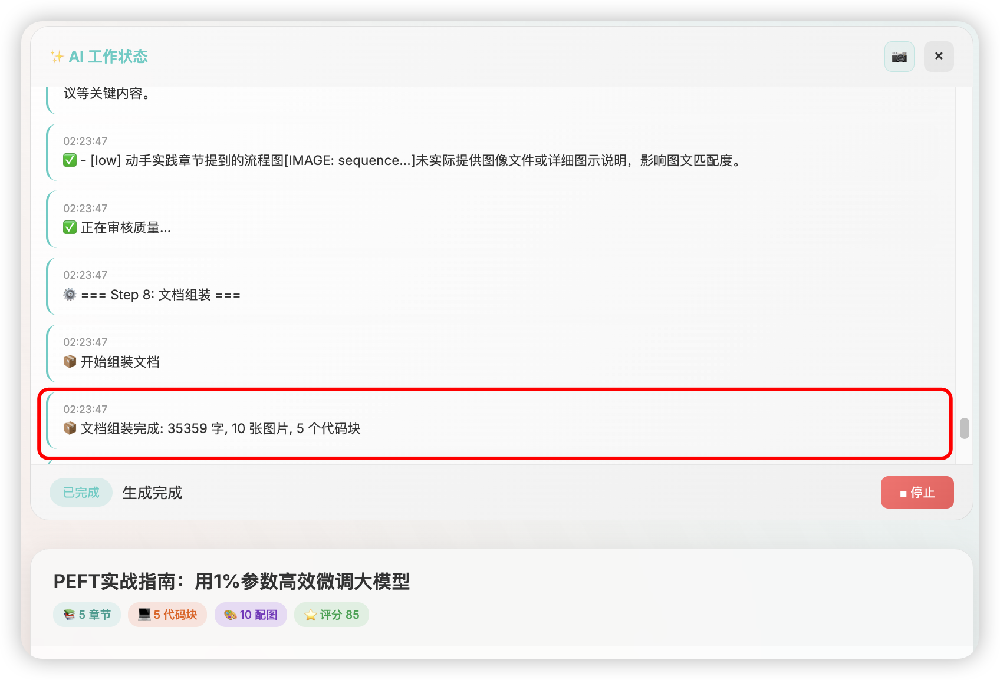</td>
<td>3-5 章节</td>
<td><code style="background:#ffebee;color:#c62828;padding:4px 12px;border-radius:12px;font-size:13px;font-weight:bold">📝 ~3.5万字</code><br><code style="background:#e8f5e9;color:#2e7d32;padding:2px 8px;border-radius:12px;font-size:12px">🎨 10 配图</code><br><code style="background:#e3f2fd;color:#7c4dff;padding:2px 8px;border-radius:12px;font-size:12px">💻 5 代码块</code></td>
<td><a href="https://lailoo.github.io/Hello-LLM-FineTuning/#/chapter4/01_PEFT%E5%AE%9E%E6%88%98%E6%8C%87%E5%8D%97">PEFT实战指南</a><br><sub>概念介绍，快速入门</sub></td>
</tr>
<tr>
<td>📑 <b>中等</b></td>
<td>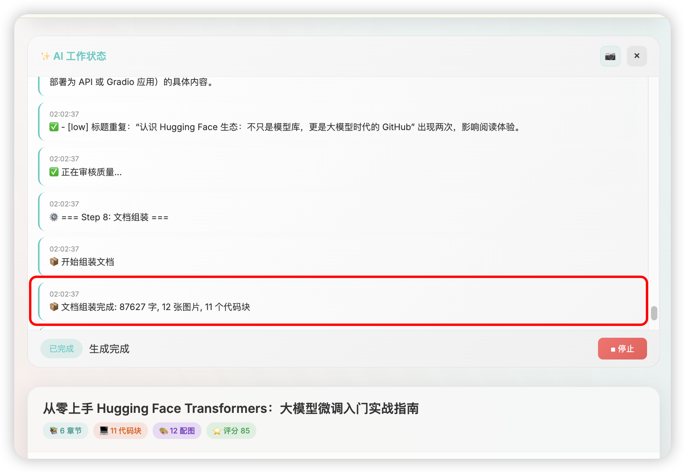</td>
<td>5-8 章节</td>
<td><code style="background:#ffebee;color:#c62828;padding:4px 12px;border-radius:12px;font-size:13px;font-weight:bold">📝 ~8.8万字</code><br><code style="background:#e8f5e9;color:#2e7d32;padding:2px 8px;border-radius:12px;font-size:12px">🎨 12 配图</code><br><code style="background:#e3f2fd;color:#7c4dff;padding:2px 8px;border-radius:12px;font-size:12px">💻 11 代码块</code></td>
<td><a href="https://lailoo.github.io/Hello-LLM-FineTuning/#/chapter3/02_Hugging_Face_Transformers%E5%85%A5%E9%97%A8">HuggingFace Transformers入门</a><br><sub>具体示例+步骤说明</sub></td>
</tr>
<tr>
<td>📚 <b>长文</b></td>
<td>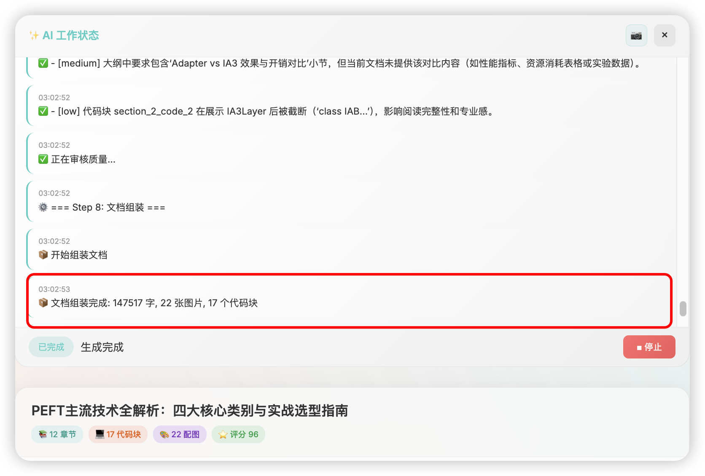</td>
<td>8-12 章节</td>
<td><code style="background:#ffebee;color:#c62828;padding:4px 12px;border-radius:12px;font-size:14px;font-weight:bold">📝 ~14.8万字</code><br><code style="background:#e8f5e9;color:#2e7d32;padding:2px 8px;border-radius:12px;font-size:12px">🎨 22 配图</code><br><code style="background:#e3f2fd;color:#7c4dff;padding:2px 8px;border-radius:12px;font-size:12px">💻 17 代码块</code></td>
<td><a href="https://lailoo.github.io/Hello-LLM-FineTuning/#/chapter4/02_PEFT%E4%B8%BB%E6%B5%81%E6%8A%80%E6%9C%AF%E5%85%A8%E8%A7%A3%E6%9E%90">PEFT主流技术全解析</a><br><sub>原理分析+数据支撑+边界情况</sub></td>
</tr>
</table>

## ✨ 项目缘起

你是否也曾陷入这样的困境：想写一篇技术博客，但不知道如何让非技术人员也能看懂；脑中有很多技术知识，却苦于无法用生动的比喻来解释？

传统的技术博客写作存在以下痛点：

- 1️⃣ **耗时费力**：一篇高质量的技术科普文章需要数小时甚至数天
- 2️⃣ **配图困难**：找不到合适的配图，Mermaid 图表语法复杂
- 3️⃣ **深度不足**：缺乏时间进行深度调研，内容容易流于表面
- 4️⃣ **受众单一**：难以针对不同技术水平的读者调整内容深度
- 5️⃣ **分发繁琐**：需要手动适配不同平台的格式要求

vibe-blog 应运而生，基于多 Agent 协作架构，自动完成调研、规划、写作、配图的全流程，让你专注于知识本身。

## 项目受众

1. **技术博主**：快速生成高质量技术科普文章，节省写作时间
2. **技术布道者**：将复杂技术转化为通俗易懂的内容，扩大影响力
3. **教育工作者**：生成教学材料，用生活化比喻帮助学生理解
4. **产品经理**：快速了解技术概念，与开发团队更好沟通
5. **技术小白**：通过 AI 生成的科普文章，轻松入门新技术

## 🖼️ 效果展示

### 首页 - 简洁优雅的输入界面

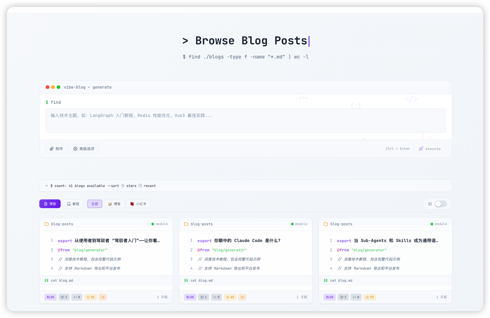

_输入主题，选择文章类型和长度，一键生成_

**文章类型**：

- 📚 **教程型**：手把手教学，从零到一掌握技术
- 🔧 **问题解决**：针对具体问题，提供解决方案
- 📊 **对比分析**：多方案对比，帮助技术选型

> 💡 **追问深度**：系统会根据文章长度自动调整内容审核标准。长文会触发更严格的深度检查，确保每个概念都有**数据支撑**和**原理分析**。
>
> 💡 **长文模式特点**：深度追问（Questioner Agent 执行 deep 级别检查）、原理剖析（不仅讲 What 和 How，更深入 Why）、数据支撑（关键论点配有数据或权威引用）、完整代码（提供可运行的完整示例）。

<details>
<summary><b>🔄 AI 工作状态 - 实时追踪生成进度（点击展开）</b></summary>

<div align="center">
<table>
<tr>
<td></td>
<td></td>
</tr>
<tr>
<td align="center"><b>Step 1: 素材收集</b><br>智能搜索网络资料</td>
<td align="center"><b>Step 2-3: 大纲规划 & 内容撰写</b><br>生成结构化大纲，逐章节撰写</td>
</tr>
<tr>
<td></td>
<td></td>
</tr>
<tr>
<td align="center"><b>Step 4: 深度追问</b><br>检查内容深度，补充细节</td>
<td align="center"><b>Step 5: 代码生成</b><br>生成可运行的示例代码</td>
</tr>
<tr>
<td></td>
<td></td>
</tr>
<tr>
<td align="center"><b>Step 6: 配图生成</b><br>Mermaid 图表 + AI 配图</td>
<td align="center"><b>Step 7: 质量审核</b><br>评分并给出改进建议</td>
</tr>
<tr>
<td></td>
<td></td>
</tr>
<tr>
<td align="center"><b>Step 8: 文档组装</b><br>组装完整文档，提炼摘要</td>
<td align="center"><b>🎉 生成完成</b><br>自动保存 Markdown 文件</td>
</tr>
</table>
</div>

</details>

### 博客输出 - 专业排版的技术文章或可爱萌科普绘本

- 长文技术博客类型样例
  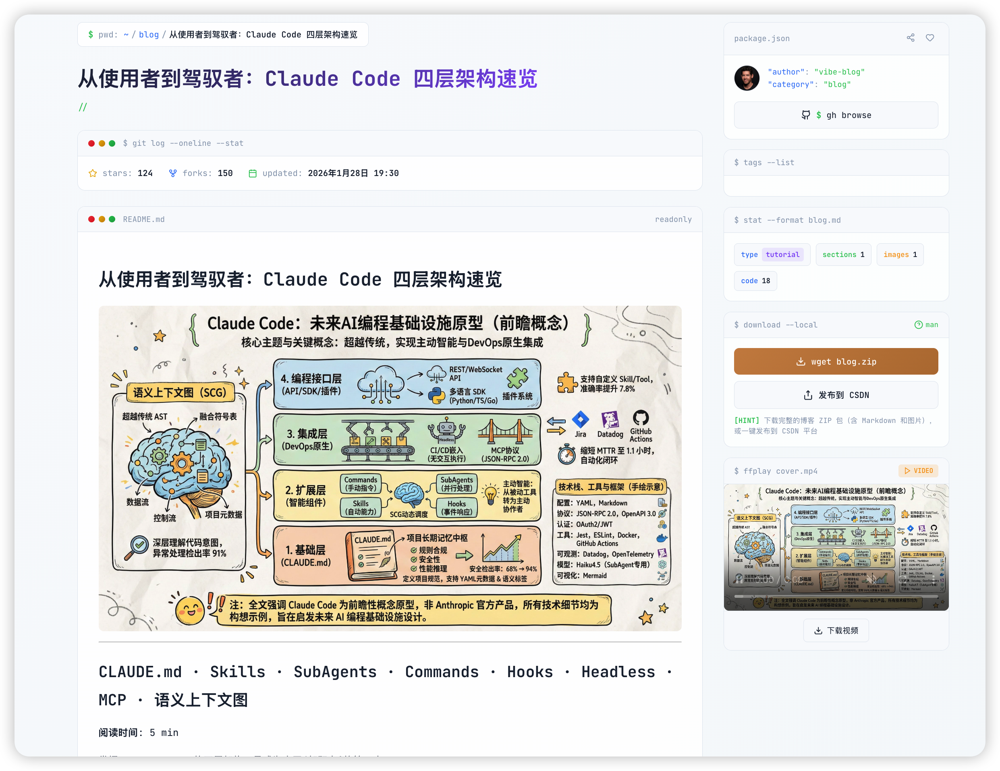

_完整博客内容预览，支持导出图片和下载 Markdown_

### vibe-reviewer - 技术教程质量评估工具

<div align="center">
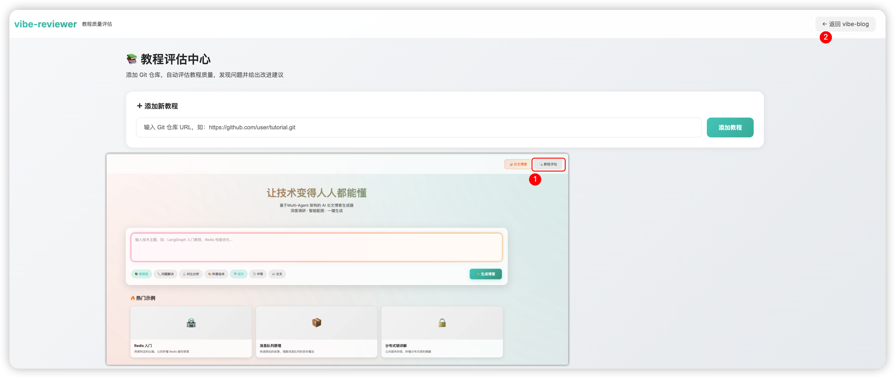
</div>

vibe-reviewer 是一个专为技术教程和博客设计的 AI 质量评估工具。通过多维度深度检查，帮助你在发布前发现内容问题、提升文章质量。支持 Git 仓库批量评估，适用于开源教程项目的质量把控。

<div align="center">
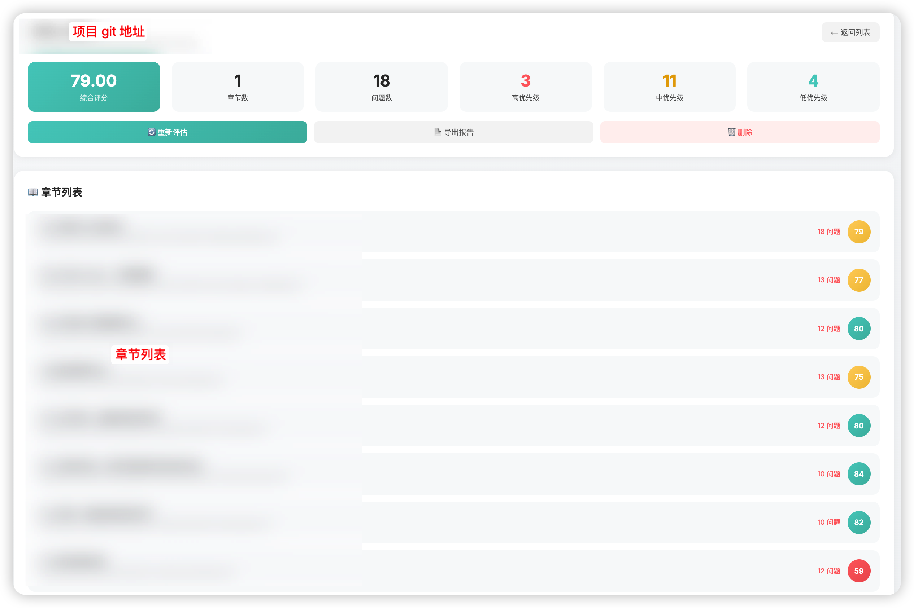
</div>

**核心能力：**

| 功能               | 说明                                             |
| ------------------ | ------------------------------------------------ |
| **多维度质量检测** | 从准确性、逻辑性、完整性、可读性四个维度评估内容 |
| **中文可读性分析** | 基于句长、段落结构、文档结构的专业可读性评分     |
| **搜索增强评估**   | 联网搜索验证技术内容的准确性和时效性             |
| **精准问题定位**   | 点击问题自动跳转到原文位置，支持高亮显示         |
| **三栏对比视图**   | 左侧文件列表、中间 Markdown 渲染、右侧问题批注   |
| **报告导出**       | 支持导出评估报告为 Markdown 格式                 |

**使用方式：**

1. 输入 Git 仓库地址（支持 GitHub/Gitee）
2. 选择评估深度（快速/标准/深度）
3. 系统自动克隆仓库、解析文档、逐一评估
4. 查看评估报告，点击问题跳转到原文位置

> 💡 **应用场景**：开源教程项目发布前的质量审核、技术博客的内容校验、团队文档的规范检查。

**问题定位功能展示：**

<div align="center">
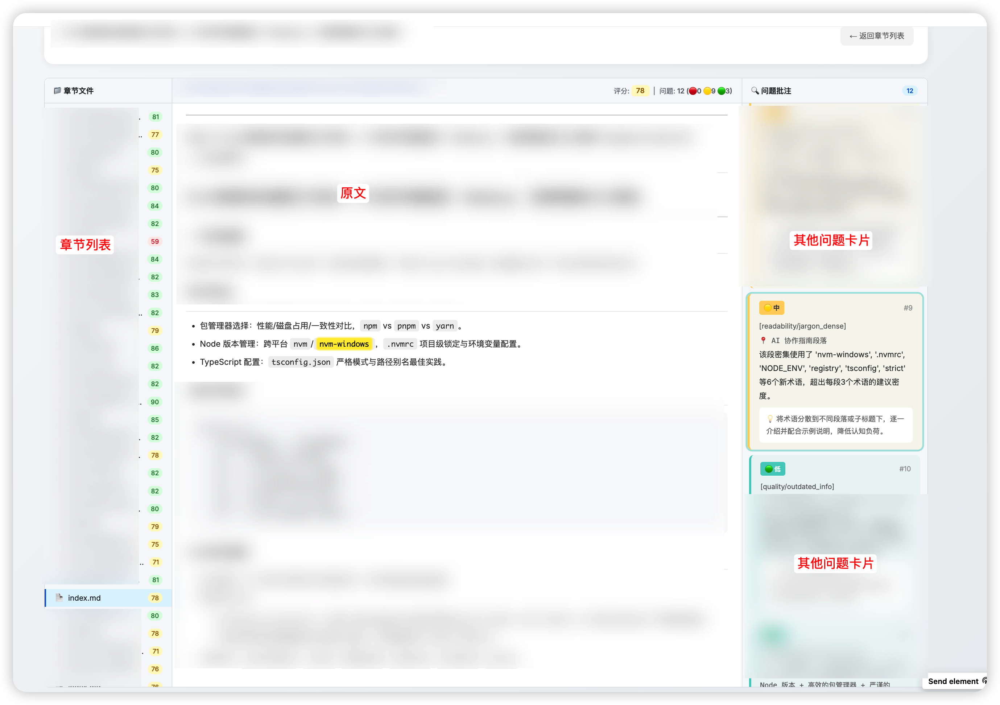
</div>

_点击问题，自动跳转到原文位置，方便快速定位和修改_

---

### 技术知识共创平台 - 博客聚合成书 🆕

<div align="center">
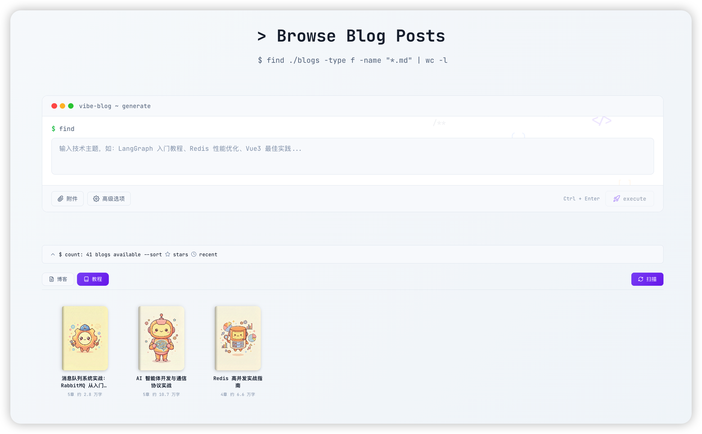
</div>

将零散的技术博客自动组织成完整的技术教程书籍，打造系统化知识的构建与在线阅读体验，搭建技术知识共创平台。

**核心能力：**

| 功能             | 说明                                                                 |
| ---------------- | -------------------------------------------------------------------- |
| **一键扫描聚合** | 自动扫描所有博客，按主题智能分类，聚合成完整技术书籍                 |
| **智能大纲生成** | LLM 分析博客内容，自动生成章节结构和完整教程大纲（含待建设章节规划） |
| **书籍首页生成** | 自动生成书籍 logo、项目简介、项目亮点、目标受众、前置要求等首页内容  |
| **在线阅读器**   | 类 GitBook 的在线阅读体验，支持侧边栏导航、章节跳转                  |

**使用方式：**

1. 生成多篇相关主题的技术博客
2. 点击「扫描聚合书籍」按钮
3. 系统自动分析、分类、生成书籍
4. 在书架页面查看和阅读完整书籍

> 💡 **应用场景**：将 Redis、消息队列、微服务等系列博客自动聚合成《XXX 实战指南》，一键生成完整技术教程。

**教程在线阅读功能展示：**

<div align="center">
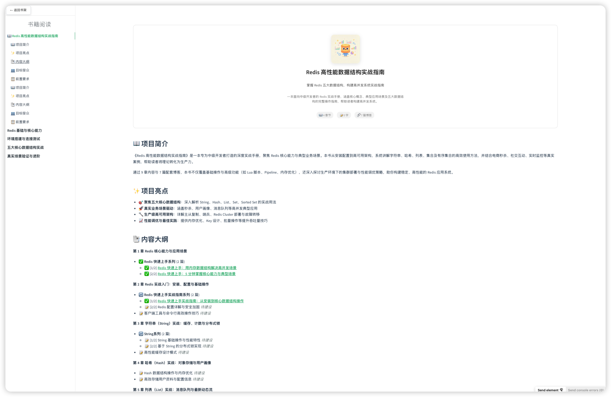
</div>

---

### 🎨 技术博客产出案例

| 博客标题                                               |                                              本地预览                                              |                               网络博客                               |
| :----------------------------------------------------- | :------------------------------------------------------------------------------------------------: | :------------------------------------------------------------------: |
| **消息队列入门实战：从零搭建异步通信系统**             |       [Markdown](./backend/outputs/消息队列入门实战_从零搭建异步通信系统_20251230_045909.md)       | [查看](https://blog.csdn.net/ll1042668699/article/details/156406666) |
| **分布式锁实战指南：30分钟掌握高并发下的资源同步控制** | [Markdown](./backend/outputs/分布式锁实战指南_30分钟掌握高并发下的资源同步控制_20251230_052151.md) | [查看](https://blog.csdn.net/ll1042668699/article/details/156406394) |
| **Redis 快速上手实战教程：从零搭建高性能缓存系统**     |  [Markdown](./backend/outputs/Redis%20快速上手实战教程_从零搭建高性能缓存系统_20251230_043948.md)  | [查看](https://blog.csdn.net/ll1042668699/article/details/156438172) |

---

## 🎯 功能介绍

### 1. 多 Agent 协作架构

<div align="center">


</div>

基于 LangGraph 构建的多 Agent 工作流，各个 Agent 分工明确，协同高效：

| Agent                 | 职责         | 核心能力                                                                                                           |
| --------------------- | ------------ | ------------------------------------------------------------------------------------------------------------------ |
| **Orchestrator**      | 总指挥       | 协调整个工作流程，管理 Agent 间通信                                                                                |
| **Researcher**        | 调研员       | 联网搜索、知识提取、文档融合                                                                                       |
| **SearchCoordinator** | 多轮搜索策略 | 根据 Writer 和 Questioner 反馈进行多轮搜索，检测知识空白，构造细化查询，填补内容缺陷                               |
| **Planner**           | 规划师       | 生成结构化大纲，设计文章框架，生成若干个章节和内容块                                                               |
| **Writer**            | 撰写师       | 循环撰写每一章节的内容，保证逻辑连贯、适配目标受众                                                                 |
| **Questioner**        | 问题追问官   | 核心控制文章长度的角色，对 Writer 输出进行深度检查，根据指定的深度类型持续深化内容，完成文章长度扩展               |
| **Coder**             | 代码员       | 生成示例代码、提供可运行代码、输出代码说明                                                                         |
| **Artist**            | 配图师       | 生成 Mermaid 图表、AI 封面图、上下文感知配图                                                                       |
| **Reviewer**          | 质量审核官   | 核心质量控制角色，对 Writer 和 Questioner 输出进行检查与评分，低于阈值或发现错误则重新生成，确保内容准确性和完整性 |
| **Assembler**         | 组装员       | 最终文档组装、多格式导出、排版优化                                                                                 |

所有 Agent 共享统一的状态管理和 Prompt 模板库，确保高效协作和一致的输出质量。

### 2. 深度调研能力

- **智谱搜索集成**：自动搜索网络获取最新技术资料
- **知识提取**：从搜索结果中提取关键信息
- **引用标注**：自动标注信息来源，确保内容可信

### 3. 智能配图系统

- **Mermaid 图表**：自动生成流程图、架构图、时序图
- **AI 封面图**：基于 nano-banana-pro 生成风格化封面
- **上下文感知**：根据章节内容生成独特的配图
- **多风格支持**：8 种配图风格（Style）可选（卡通手绘、水墨古风、科研学术、Chiikawa萌系、Biesty剖面图、白板笔记、简约极简、深色科技）
- **Type×Style 二维系统** 🆕：引入 6 种插图类型（Type）—— 信息图、场景图、流程图、对比图、框架图、时间线，基于内容信号自动推荐最佳类型，Type 决定结构骨架，Style 决定视觉皮肤

### 4. LLM 调用链路追踪（Langfuse）🆕

- **Langfuse 集成**：通过 `CallbackHandler` 自动追踪 LangGraph 工作流中每个 Agent 的 LLM 调用
- **可视化分析**：Trace 视图、调用树、耗时统计、Token 费用分析
- **零侵入**：环境变量 `TRACE_ENABLED=true` 一键开启，不影响现有代码

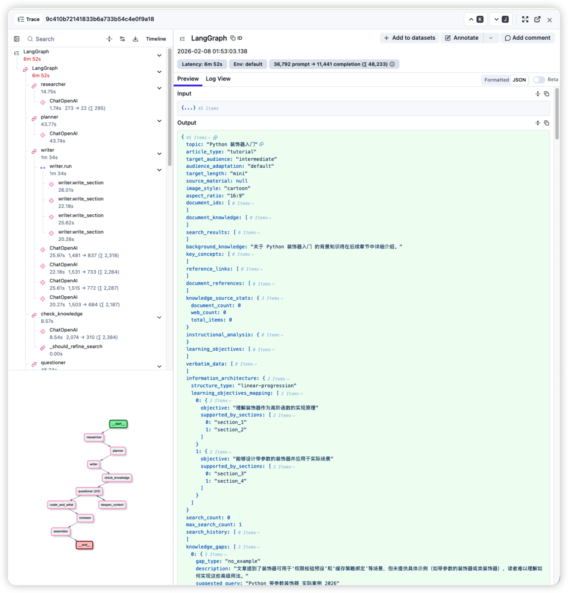

### 5. 多格式导出

- **Markdown**：标准 Markdown 格式，支持直接发布
- **图片导出**：一键将文章导出为长图
- **实时预览**：前端实时渲染 Markdown 和 Mermaid 图表

## 🗺️ 开发计划

### ✅ 已完成功能

| #   | 状态 | 功能                             | 说明                                                                                                                     |
| --- | ---- | -------------------------------- | ------------------------------------------------------------------------------------------------------------------------ |
| 1   | ✅   | 多 Agent 架构                    | 10 个 Agent 协作：Orchestrator/Researcher/SearchCoordinator/Planner/Writer/Questioner/Coder/Artist/Reviewer/Assembler    |
| 2   | ✅   | 联网搜索                         | 智谱搜索 API 集成                                                                                                        |
| 3   | ✅   | 多轮搜索                         | 迭代式深度调研                                                                                                           |
| 4   | ✅   | Mermaid 图表                     | 流程图/架构图自动生成                                                                                                    |
| 5   | ✅   | AI 封面图                        | Nano Banana Pro 生成                                                                                                     |
| 6   | ✅   | 实时预览                         | SSE 进度推送 + Markdown 渲染                                                                                             |
| 7   | ✅   | 图片导出                         | 文章导出为图片                                                                                                           |
| 8   | ✅   | 自定义知识源1+2期                | PDF/MD/TXT 解析 + 知识分块 + 图片摘要                                                                                    |
| 9   | ✅   | 技术书籍生成                     | 系列博客聚合成完整书籍，参见 [大模型微调开源项目](https://lailoo.github.io/Hello-LLM-FineTuning/#/)                      |
| 10  | ✅   | 历史文章记录                     | 自动保存生成历史，支持查看和删除                                                                                         |
| 11  | ✅   | AI 科普绘本风格                  | 支持将技术内容转化为通俗易懂的科普绘本                                                                                   |
| 12  | ✅   | 在线体验                         | 域名申请中，当前可先加入项目内测讨论群, 群里有IP链接                                                                     |
| 13  | ✅   | **教程评估模块 (vibe-reviewer)** | Git 仓库教程质量评估：深度检查 + 质量审核 + 可读性分析，支持搜索增强评估、SSE 实时进度、Markdown 报告导出                |
| 14  | ✅   | **自动配图**      | 8 种配图风格（Style）+ 6 种插图类型（Type）：内容信号自动推荐、兼容性降级，Type 决定结构骨架，Style 决定视觉皮肤        |
| 15  | ✅   | **智能书籍构建系统**             | 一键扫描聚合博客成书籍、智能大纲生成、书籍首页生成、Docsify 阅读器、博客归属标签                                         |
| 16  | ✅   | **CSDN 一键发布**                | 基于 Playwright 浏览器自动化，支持 Cookie 认证、智能标签、封面图处理                                                     |
| 17  | ✅   | **Langfuse LLM 调用链路追踪**    | 集成 Langfuse Cloud，自动追踪每个 Agent 的 LLM 调用，支持 Trace 视图、耗时统计、Token 费用分析                           |

<details>
<summary><b>🚀 未来规划（6 大方向，点击展开）</b></summary>

#### 📂 方向一：更多的输入源解析能力

| #   | 状态      | 功能            | 说明                                |
| --- | --------- | --------------- | ----------------------------------- |
| 1   | 🚧 开发中 | 自定义知识源3期 | 多文件上传 + 文档预览 + 性能优化    |
| 2   | 🧭 规划中 | 自定义网页输入  | 从指定 URL 下载网页内容作为知识来源 |
| 3   | 🧭 规划中 | GitHub 仓库解析 | 集成代码仓库，自动分析和原理解读    |
| 4   | 🧭 规划中 | 视频字幕整理    | B 站技术视频字幕提取与内容聚合      |
| 5   | 🧭 规划中 | 外挂知识库      | 接入指定知识库源                    |

#### 🔬 方向二：更专业的深度分析能力

| #   | 状态      | 功能         | 说明                               |
| --- | --------- | ------------ | ---------------------------------- |
| 1   | 🧭 规划中 | 优化搜索源   | 接入专业 AI 博客和论文网站         |
| 2   | 🧭 规划中 | 论文解读     | 英文论文秒变中文技术方案           |
| 3   | 🧭 规划中 | 原文图表整合 | 将调研原文中的图表混合插入文章     |
| 4   | 🧭 规划中 | 博客类型细分 | 综述型、深究型、实战型、源码解析型 |

#### ✍️ 方向三：更通俗的写作风格

| #   | 状态      | 功能        | 说明                       |
| --- | --------- | ----------- | -------------------------- |
| 1   | 🧭 规划中 | 多受众适配  | 高中生版 / 儿童版 / 职场版 |
| 2   | 🧭 规划中 | 自定义编辑  | 选定内容后通过语言指令优化 |
| 3   | 🧭 规划中 | AI 智能导读 | 思维导图 + 交互式阅读      |

#### 🎨 方向四：更多样的展示形式

| #   | 状态      | 功能       | 说明                         |
| --- | --------- | ---------- | ---------------------------- |
| 1   | 🧭 规划中 | 视频讲解   | 将书籍和论文转化为解释视频   |
| 2   | 🧭 规划中 | 播客输出   | TTS 语音合成                 |
| 3   | 🧭 规划中 | 漫画形式   | 图文并茂的漫画风格输出       |
| 4   | 🧭 规划中 | 自定义封面 | 以图生图，参考样式配置       |
| 5   | 🧭 规划中 | 灵活配图   | 一章一图、多章一图等多种模式 |

#### 🌐 方向五：从单一博客到技术知识共创平台

| #   | 状态        | 功能                 | 说明                                                                 |
| --- | ----------- | -------------------- | -------------------------------------------------------------------- |
| 1   | 🧭 规划中   | GitHub Pages 部署    | GitHub Actions 自动构建并部署到 GitHub Pages                         |
| 2   | 🧭 规划中   | 网站服务化           | 构建完整的在线服务平台                                               |
| 3   | 🧭 规划中   | 分享功能             | 支持文章、书籍的社交分享                                             |
| 4   | ✅          | **CSDN 一键发布**    | 基于 Playwright 浏览器自动化，支持 Cookie 认证、智能标签、封面图处理 |
| 5   | 🚧 开发中   | 更多平台支持         | 掘金、知乎、小红书、微信公众号等平台                                 |
| 5   | 🎯 终极目标 | **技术知识共创平台** | 共创技术书籍、问题聚合、Knowledge Graph                              |

#### 📝 方向六：智能写作IDE客户端建设

| #   | 状态      | 功能               | 说明                                                 |
| --- | --------- | ------------------ | ---------------------------------------------------- |
| 1   | 🧭 规划中 | 技术写作AI IDE建设 | 与 VS Code 深度整合，打造类 Cursor 的技术写作 AI IDE |
| 2   | 🧭 规划中 | 专业知识库嵌入     | 内置技术领域知识库，提升生成质量                     |
| 3   | 🧭 规划中 | 提示词模板库       | 预设多种技术写作模板，一键调用                       |
| 4   | 🧭 规划中 | 技术角色系统       | 可切换不同技术专家角色（架构师/算法工程师/运维等）   |
| 5   | 🧭 规划中 | 本地笔记客户端     | 独立桌面应用，支持离线使用                           |
| 6   | 🧭 规划中 | 素材收集助手       | 快速收集网页/文档/代码片段作为写作素材               |

</details>

## 📖 使用方法

> ⚡️ **推荐方式**：使用 Docker 部署（简单、一致性保证）
>
> 📖 详细文档：[Docker 部署指南](./docker/DOCKER_DEPLOY.md)

### 方式一：Docker 部署（推荐）

1. **配置环境变量**

   ```bash
   cp backend/.env.example backend/.env
   # 编辑 .env 配置 API key
   ```

   编辑 `backend/.env` 文件，配置必要的环境变量：

   ```env
   # AI Provider 格式配置
   AI_PROVIDER_FORMAT=openai

   # OpenAI 兼容 API 配置
   OPENAI_API_KEY=your-api-key-here
   OPENAI_API_BASE=https://dashscope.aliyuncs.com/compatible-mode/v1
   TEXT_MODEL=qwen3-max-preview

   # 智谱搜索 API（可选，用于深度调研）
   ZAI_SEARCH_API_KEY=your-zhipu-api-key

   # Nano Banana Pro API（可选，用于 AI 封面图）
   NANO_BANANA_API_KEY=your-nano-banana-api-key
   NANO_BANANA_API_BASE=https://grsai.dakka.com.cn
   ```

2. **启动服务**

   ```bash
   docker compose -f docker/docker-compose.yml up -d
   ```

3. **访问应用**
   - 前端：http://localhost:3000
   - API：http://localhost:5000

4. **管理命令**
   ```bash
   # 查看日志
   docker compose -f docker/docker-compose.yml logs -f
   # 停止服务
   docker compose -f docker/docker-compose.yml down
   ```

### 方式二：本地开发部署

1. **克隆代码仓库**

   ```bash
   git clone https://github.com/datawhalechina/vibe-blog
   ```

2. **创建虚拟环境**

   ```bash
   python -m venv .venv
   source .venv/bin/activate  # Linux/macOS
   # .venv\Scripts\activate  # Windows PowerShell
   ```

3. **安装依赖**

   ```bash
   pip install -r requirements-dev.txt
   npm run install:frontend
   ```

4. **配置环境变量**

   ```bash
   cp backend/.env.example backend/.env
   # 编辑 .env 配置必要环境变量
   ```

   编辑 `backend/.env` 文件，配置必要的环境变量：

   ```env
   # AI Provider 格式配置
   AI_PROVIDER_FORMAT=openai

   # OpenAI 兼容 API 配置
   OPENAI_API_KEY=your-api-key-here
   OPENAI_API_BASE=https://dashscope.aliyuncs.com/compatible-mode/v1
   TEXT_MODEL=qwen3-max-preview

   # 智谱搜索 API（可选，用于深度调研）
   ZAI_SEARCH_API_KEY=your-zhipu-api-key

   # Nano Banana Pro API（可选，用于 AI 封面图）
   NANO_BANANA_API_KEY=your-nano-banana-api-key
   NANO_BANANA_API_BASE=https://grsai.dakka.com.cn
   ```

5. **启动服务**

   ```bash
   # 后端
   cd backend
   python app.py

   # 新开一个终端，在仓库根目录启动前端
   cd ..
   cd frontend
   npm run dev
   ```

6. **访问应用**
   - 前端：http://localhost:5173
   - API：http://localhost:5001/api

## 🛠️ 技术架构

### AI 模型与服务

| 功能         | 服务商      | 模型/API        | 说明                             |
| ------------ | ----------- | --------------- | -------------------------------- |
| **文本生成** | 阿里云百炼  | Qwen (千问)     | 用于 Agent 的文本生成和推理      |
| **联网搜索** | 智谱        | Web Search API  | 用于 Researcher Agent 的深度调研 |
| **AI 配图**  | Nano Banana | nano-banana-pro | 用于生成 AI 封面图和配图         |

### API 调用端点

- **文本模型**：OpenAI 兼容 API 格式
- **搜索服务**：`https://open.bigmodel.cn/api/paas/v4/web_search`
- **图片生成**：我这里使用的是grsai模型服务: `https://grsai.dakka.com.cn`（国内直连）

### 前端技术栈

- **框架**：Vue 3 + Vite
- **Markdown**：marked.js
- **代码高亮**：highlight.js
- **图表渲染**：Mermaid.js

<details>
<summary><b>📁 项目结构（点击展开）</b></summary>

```
vibe-blog/
├── requirements.txt                      # 后端运行依赖入口
├── requirements-dev.txt                  # 后端开发/测试依赖入口
├── package.json                          # 前端常用命令入口
├── backend/                              # Flask 后端应用
│   ├── app.py                            # Flask 应用入口 + API 路由
│   ├── config.py                         # 配置文件
│   ├── requirements.txt                  # 后端运行依赖
│   ├── requirements-test.txt             # 后端测试依赖
│   ├── .env.example                      # 环境变量示例
│   ├── outputs/                          # 生成的文章输出目录
│   │   └── images/                       # AI 生成的配图
│   └── services/
│       ├── llm_service.py                # LLM 服务封装
│       ├── image_service.py              # 图片生成服务 (Nano Banana)
│       ├── task_service.py               # SSE 任务管理
│       ├── database_service.py           # 数据库服务
│       ├── file_parser_service.py        # 文件解析服务 (PDF/MD/TXT)
│       ├── knowledge_service.py          # 知识管理服务
│       ├── pipeline_service.py           # 流水线服务
│       ├── transform_service.py          # 转换服务
│       ├── prompts/                      # 服务层 Prompt 模板
│       │   ├── document_summary.j2       # 文档摘要 Prompt
│       │   └── image_caption.j2          # 图片描述 Prompt
│       └── blog_generator/               # 博客生成器核心
│           ├── blog_service.py           # 博客生成服务入口
│           ├── generator.py              # LangGraph 工作流定义
│           ├── agents/                   # 10 个 Agent 实现
│           │   ├── researcher.py         # 调研 Agent - 联网搜索
│           │   ├── search_coordinator.py # 搜索协调 Agent - 多轮搜索
│           │   ├── planner.py            # 规划 Agent - 大纲生成
│           │   ├── writer.py             # 写作 Agent - 内容撰写
│           │   ├── questioner.py         # 追问 Agent - 深度检查
│           │   ├── coder.py              # 代码 Agent - 示例生成
│           │   ├── artist.py             # 配图 Agent - Mermaid + AI 图
│           │   ├── reviewer.py           # 审核 Agent - 质量评分
│           │   └── assembler.py          # 组装 Agent - 文档合成
│           ├── templates/                # Jinja2 Prompt 模板
│           │   ├── researcher.j2         # 调研 Prompt
│           │   ├── planner.j2            # 规划 Prompt
│           │   ├── writer.j2             # 写作 Prompt
│           │   ├── writer_enhance.j2     # 写作增强 Prompt
│           │   ├── writer_enhance_knowledge.j2  # 知识增强写作 Prompt
│           │   ├── questioner.j2         # 追问 Prompt
├── frontend/                             # Vue 3 前端应用
│   ├── package.json                      # 前端依赖与脚本
│   ├── vite.config.ts                    # 开发与构建配置
│   └── src/                              # 前端源码
│           │   ├── coder.j2              # 代码 Prompt
│           │   ├── artist.j2             # 配图 Prompt
│           │   ├── cover_image_prompt.j2 # 封面图 Prompt
│           │   ├── reviewer.j2           # 审核 Prompt
│           │   ├── search_query.j2       # 搜索查询 Prompt
│           │   ├── search_summarizer.j2  # 搜索摘要 Prompt
│           │   ├── knowledge_gap_detector.j2  # 知识缺口检测 Prompt
│           │   ├── assembler_header.j2   # 组装头部 Prompt
│           │   └── assembler_footer.j2   # 组装尾部 Prompt
│           ├── prompts/
│           │   └── prompt_manager.py     # Prompt 渲染管理
│           ├── schemas/
│           │   └── state.py              # 共享状态定义
│           ├── post_processors/
│           │   └── markdown_formatter.py # Markdown 后处理
│           ├── utils/
│           │   └── helpers.py            # 工具函数
│           └── services/
│               └── search_service.py     # 智谱搜索服务
│   └── vibe_reviewer/                    # 教程评估模块 (vibe-reviewer)
│       ├── __init__.py                   # 模块入口
│       ├── reviewer_service.py           # 评估服务核心
│       ├── schemas.py                    # 数据模型定义
│       ├── api/
│       │   └── routes.py                 # API 路由 (SSE 进度推送 + 报告导出)
│       ├── models/
│       │   └── reviewer_models.py        # SQLite 数据库模型
│       ├── pipeline/                     # 评估流水线
│       │   ├── content_analyzer.py       # 内容分析器
│       │   ├── depth_checker.py          # 深度检查器
│       │   ├── quality_reviewer.py       # 质量审核器
│       │   ├── readability_checker.py    # 可读性检查器
│       │   ├── search_agent.py           # 搜索增强 Agent
│       │   └── reference_manager.py      # 参考资料管理
│       └── templates/                    # Jinja2 Prompt 模板
│           ├── analyze_content.j2        # 内容分析 Prompt
│           ├── depth_check.j2            # 深度检查 Prompt
│           ├── quality_review.j2         # 质量审核 Prompt
│           └── readability_check.j2      # 可读性检查 Prompt
├── logo/                                 # Logo 资源
└── README.md
```

</details>

<details>
<summary><b>🔧 环境变量配置（点击展开）</b></summary>

### Flask 配置

| 变量名         | 说明           | 示例值                 |
| -------------- | -------------- | ---------------------- |
| `FLASK_ENV`    | Flask 运行环境 | development            |
| `SECRET_KEY`   | Flask 密钥     | vibe-blog-secret-key |
| `LOG_LEVEL`    | 日志级别       | INFO                   |
| `CORS_ORIGINS` | CORS 允许的源  | \*                     |

### AI 模型配置

| 变量名                | 说明             | 示例值                   |
| --------------------- | ---------------- | ------------------------ |
| `AI_PROVIDER_FORMAT`  | AI Provider 格式 | openai                   |
| `TEXT_MODEL`          | 文本生成模型     | qwen3-max-preview        |
| `IMAGE_CAPTION_MODEL` | 图片摘要模型     | qwen3-vl-plus-2025-12-19 |

### OpenAI 兼容 API 配置

| 变量名            | 说明                     | 示例值                                            |
| ----------------- | ------------------------ | ------------------------------------------------- |
| `OPENAI_API_KEY`  | OpenAI 兼容 API Key      | sk-xxx                                            |
| `OPENAI_API_BASE` | OpenAI 兼容 API 基础 URL | https://dashscope.aliyuncs.com/compatible-mode/v1 |

### 图片生成配置（Nano Banana）

| 变量名                 | 说明                     | 示例值                     |
| ---------------------- | ------------------------ | -------------------------- |
| `NANO_BANANA_API_KEY`  | Nano Banana API Key      | sk-xxx                     |
| `NANO_BANANA_API_BASE` | Nano Banana API 基础 URL | https://grsai.dakka.com.cn |
| `NANO_BANANA_MODEL`    | Nano Banana 模型名称     | nano-banana-pro            |

### 搜索配置（智谱 Web Search）

| 变量名                      | 说明                    | 示例值                                          |
| --------------------------- | ----------------------- | ----------------------------------------------- |
| `ZAI_SEARCH_API_KEY`        | 智谱 Web Search API Key | xxx                                             |
| `ZAI_SEARCH_API_BASE`       | 智谱搜索 API 基础 URL   | https://open.bigmodel.cn/api/paas/v4/web_search |
| `ZAI_SEARCH_ENGINE`         | 搜索引擎类型            | search_pro_quark                                |
| `ZAI_SEARCH_MAX_RESULTS`    | 搜索最大结果数          | 5                                               |
| `ZAI_SEARCH_CONTENT_SIZE`   | 搜索内容大小            | medium                                          |
| `ZAI_SEARCH_RECENCY_FILTER` | 搜索时效过滤            | noLimit                                         |

### 多轮搜索配置

| 变量名                    | 说明                 | 示例值 |
| ------------------------- | -------------------- | ------ |
| `MULTI_SEARCH_MAX_SHORT`  | 短文最大搜索次数     | 3      |
| `MULTI_SEARCH_MAX_MEDIUM` | 中等文章最大搜索次数 | 5      |
| `MULTI_SEARCH_MAX_LONG`   | 长文最大搜索次数     | 8      |

### 文件解析配置（MinerU）

| 变量名            | 说明                | 示例值             |
| ----------------- | ------------------- | ------------------ |
| `MINERU_TOKEN`    | MinerU 服务 Token   | xxx                |
| `MINERU_API_BASE` | MinerU API 基础 URL | https://mineru.net |

### 知识融合配置

| 变量名                         | 说明         | 示例值 |
| ------------------------------ | ------------ | ------ |
| `KNOWLEDGE_MAX_CONTENT_LENGTH` | 最大内容长度 | 8000   |
| `KNOWLEDGE_MAX_DOC_ITEMS`      | 最大文档项数 | 10     |
| `KNOWLEDGE_CHUNK_SIZE`         | 知识分块大小 | 2000   |
| `KNOWLEDGE_CHUNK_OVERLAP`      | 知识分块重叠 | 200    |

### Langfuse 追踪配置（可选）

| 变量名               | 说明                        | 示例值                          |
| -------------------- | --------------------------- | ------------------------------- |
| `TRACE_ENABLED`      | 是否开启 LLM 调用链路追踪  | true                            |
| `LANGFUSE_PUBLIC_KEY` | Langfuse Public Key         | pk-lf-xxx                       |
| `LANGFUSE_SECRET_KEY` | Langfuse Secret Key         | sk-lf-xxx                       |
| `LANGFUSE_HOST`      | Langfuse 服务地址（自托管） | https://cloud.langfuse.com      |

> 💡 Langfuse Cloud 免费版提供 50k traces/月，注册地址：https://cloud.langfuse.com

</details>

## 贡献者名单

| 姓名 | 职责                                     | 简介                                                                                         |
| :--- | :--------------------------------------- | :------------------------------------------------------------------------------------------- |
| 三点 | vibe-blog项目负责人                      | 一枚后端在职 Coder，专注于AI技术学习与探索, 探索 AI+内容创作的无限可能, 热爱 Vibe, 崇尚分享  |
| 佳玥 | 多种受众适配的技术风格博客生成能力贡献者 | 一个大模型应用实习生，正在努力把大模型从"看起来很强"调成"真的能用"。相信开源！               |
| 小乔 | ASR音频转录摘要提取模块以及视频模态探索  | 一个营销人，想解决文科生跨越术语障碍、直击底层原理的学习模式，加速理解后在实际场景中输出应用 |

_注：表头可自定义，但必须在名单中标明项目负责人_

## 参与贡献

- 如果你发现了一些问题，可以提Issue进行反馈，如果提完没有人回复你可以联系[保姆团队](https://github.com/datawhalechina/DOPMC/blob/main/OP.md)的同学进行反馈跟进~
- 如果你想参与贡献本项目，可以提Pull request，如果提完没有人回复你可以联系[保姆团队](https://github.com/datawhalechina/DOPMC/blob/main/OP.md)的同学进行反馈跟进~
- 如果你对 Datawhale 很感兴趣并想要发起一个新的项目，请按照[Datawhale开源项目指南](https://github.com/datawhalechina/DOPMC/blob/main/GUIDE.md)进行操作即可~

## 项目内测群:

如需在线体验，可以扫描入群


## 关注我们

<div align=center>
<p>扫描下方二维码关注公众号：Datawhale</p>

</div>

## LICENSE

<a rel="license" href="http://creativecommons.org/licenses/by-nc-sa/4.0/"></a><br />本作品采用<a rel="license" href="http://creativecommons.org/licenses/by-nc-sa/4.0/">知识共享署名-非商业性使用-相同方式共享 4.0 国际许可协议</a>进行许可。
