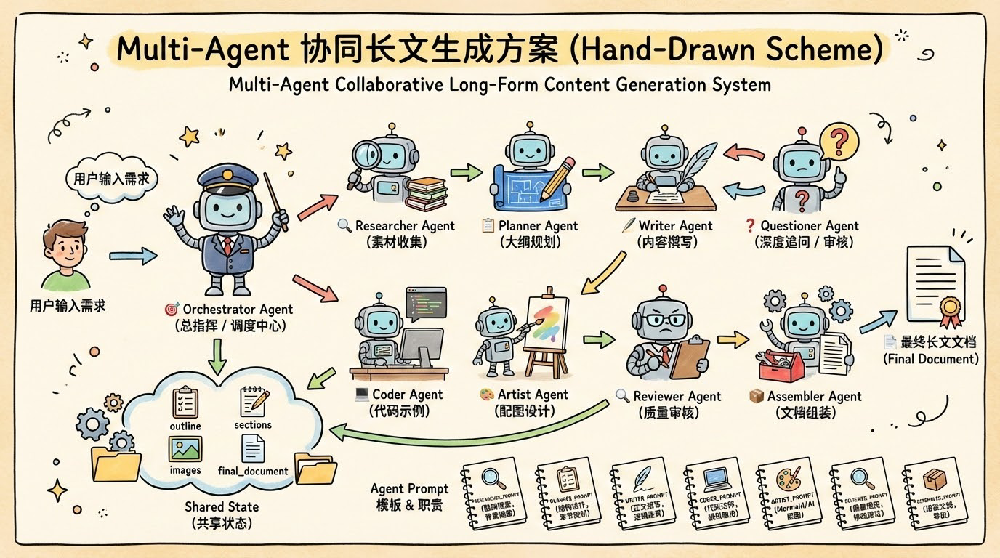

<div align="center">


_Turn complex tech into stories everyone can understand._

**[中文](README.md) | English**

<p>

[](https://github.com/datawhalechina/vibe-blog)


</p>

<b>A multi-Agent AI-powered long-form blog generator with deep research, smart illustrations, and Mermaid diagrams,<br></b>
<b>transforming technical knowledge into easy-to-understand articles for everyone</b>

<b>🎯 Lower the barrier to technical writing, making knowledge sharing simpler</b>

<br>

_If this project is useful to you, please star🌟 & fork🍴_

<br>

</div>

## ✨ Project Origin

Have you ever been stuck in this situation: you want to write a technical blog, but don't know how to make it understandable for non-technical readers; you have lots of technical knowledge in mind, but struggle to explain it with vivid metaphors?

Traditional technical blog writing has the following pain points:

- 1️⃣ **Time-consuming**: A high-quality technical article takes hours or even days
- 2️⃣ **Illustration difficulties**: Hard to find suitable images, Mermaid syntax is complex
- 3️⃣ **Lack of depth**: No time for deep research, content tends to be superficial
- 4️⃣ **Single audience**: Difficult to adjust content depth for readers of different technical levels
- 5️⃣ **Tedious distribution**: Need to manually adapt to different platform format requirements

vibe-blog was born to solve these problems. Based on multi-Agent collaborative architecture, it automatically completes the entire process of research, planning, writing, and illustration, letting you focus on the knowledge itself.

## 👨‍💻 Use Cases

1. **Tech Bloggers**: Quickly generate high-quality technical articles, saving writing time
2. **Developer Advocates**: Transform complex technology into easy-to-understand content, expanding influence
3. **Educators**: Generate teaching materials, using life-like metaphors to help students understand
4. **Product Managers**: Quickly understand technical concepts, better communicate with development teams
5. **Tech Beginners**: Easily get started with new technologies through AI-generated articles

## 🖼️ Demo & Results

### Homepage - Clean and Elegant Input Interface


_Input topic, select article type and length, generate with one click_

**Article Types**:

- 📚 **Tutorial**: Step-by-step teaching, master technology from zero to one
- 🔧 **Problem Solving**: Targeted solutions for specific problems
- 📊 **Comparative Analysis**: Multi-solution comparison to help with tech selection

**Article Length**:

|    Length     |   Chapters    | Reading Time |  Depth  | Use Case                                                              |
| :-----------: | :-----------: | :----------: | :-----: | :-------------------------------------------------------------------- |
| 📄 **Short**  | 3-5 chapters  |   ~30 min    | shallow | Quick introduction, fast start                                        |
| 📑 **Medium** | 5-8 chapters  |   ~60 min    | medium  | Concrete examples + step-by-step, deep learning                       |
|  📚 **Long**  | 8-12 chapters |   ~90+ min   |  deep   | Principle analysis + data support + edge cases, comprehensive mastery |

> 💡 **Questioning Depth**: The system automatically adjusts content review standards based on article length. Long articles trigger stricter depth checks to ensure each concept has data support and principle analysis.

### AI Workflow Status - Real-time Generation Progress Tracking

<div align="center">
<table>
<tr>
<td></td>
<td></td>
</tr>
<tr>
<td align="center"><b>Step 1: Material Collection</b><br>Intelligent web search for resources</td>
<td align="center"><b>Step 2-3: Outline Planning & Content Writing</b><br>Generate structured outline, write by chapter</td>
</tr>
<tr>
<td></td>
<td></td>
</tr>
<tr>
<td align="center"><b>Step 4: Depth Questioning</b><br>Check content depth, supplement details</td>
<td align="center"><b>Step 5: Code Generation</b><br>Generate runnable example code</td>
</tr>
<tr>
<td></td>
<td></td>
</tr>
<tr>
<td align="center"><b>Step 6: Image Generation</b><br>Mermaid diagrams + AI images</td>
<td align="center"><b>Step 7: Quality Review</b><br>Score and provide improvement suggestions</td>
</tr>
<tr>
<td></td>
<td></td>
</tr>
<tr>
<td align="center"><b>Step 8: Document Assembly</b><br>Assemble complete document, extract summary</td>
<td align="center"><b>🎉 Generation Complete</b><br>Auto-save Markdown file</td>
</tr>
</table>
</div>

### Blog Results - Professional Technical Articles


_Complete blog content preview, supports image export and Markdown download_

---

## 🎨 Blog Generation Examples

| Blog Title                                                                                           |                                            Local Preview                                             |                                 CSDN                                 |
| :--------------------------------------------------------------------------------------------------- | :--------------------------------------------------------------------------------------------------: | :------------------------------------------------------------------: |
| **Triton Deployment Practical Guide: From Design Principles to Production**                          |     [Markdown](./backend/outputs/Triton%20部署实战指南_从设计思想到生产落地_20251231_034839.md)      | [View](https://blog.csdn.net/ll1042668699/article/details/156437086) |
| **vLLM Inference Engine Deep Dive: Core Acceleration Mechanisms and Component Principles**           | [Markdown](./backend/outputs/vLLM推理引擎深度拆解_核心加速机制与组件原理实战指南_20251231_031953.md) | [View](https://blog.csdn.net/ll1042668699/article/details/156436798) |
| **Message Queue Getting Started: Building an Async Communication System from Scratch**               |        [Markdown](./backend/outputs/消息队列入门实战_从零搭建异步通信系统_20251230_045909.md)        | [View](https://blog.csdn.net/ll1042668699/article/details/156406666) |
| **Distributed Lock Practical Guide: Master High-Concurrency Resource Synchronization in 30 Minutes** |  [Markdown](./backend/outputs/分布式锁实战指南_30分钟掌握高并发下的资源同步控制_20251230_052151.md)  | [View](https://blog.csdn.net/ll1042668699/article/details/156406394) |
| **RAG Evolution Illustrated: Traditional RAG vs Graph RAG Architecture Comparison**                  | [Markdown](./backend/outputs/图解RAG进化_传统RAG%20vs%20Graph%20RAG架构实战对比_20251231_042358.md)  | [View](https://blog.csdn.net/ll1042668699/article/details/156437897) |
| **Redis Quick Start Tutorial: Building a High-Performance Cache System from Scratch**                |   [Markdown](./backend/outputs/Redis%20快速上手实战教程_从零搭建高性能缓存系统_20251230_043948.md)   | [View](https://blog.csdn.net/ll1042668699/article/details/156438172) |

## 🎯 Feature Introduction

### 1. Multi-Agent Collaborative Architecture

<div align="center">



</div>

Based on LangGraph, multi-Agent workflow with clear division of labor and efficient collaboration:

| Agent                 | Role               | Core Capability                                                                                    |
| --------------------- | ------------------ | -------------------------------------------------------------------------------------------------- |
| **Orchestrator**      | Director           | Coordinate entire workflow, manage Agent communication                                             |
| **Researcher**        | Researcher         | Web search, knowledge extraction, document fusion                                                  |
| **SearchCoordinator** | Multi-round Search | Multi-round search based on Writer/Questioner feedback, detect knowledge gaps                      |
| **Planner**           | Planner            | Generate structured outlines, design article framework                                             |
| **Writer**            | Writer             | Write each chapter content in loop, ensure logical coherence                                       |
| **Questioner**        | Depth Checker      | Core role for article length control, deep check Writer output, expand content based on depth type |
| **Coder**             | Coder              | Generate example code, provide runnable code                                                       |
| **Artist**            | Illustrator        | Generate Mermaid diagrams, AI cover images                                                         |
| **Reviewer**          | Quality Controller | Core quality control role, check and score Writer/Questioner output, regenerate if below threshold |
| **Assembler**         | Assembler          | Final document assembly, multi-format export                                                       |

All Agents share unified state management and Prompt template library, ensuring efficient collaboration and consistent output quality.

### 2. Deep Research Capability

- **Zhipu Search Integration**: Automatically search the web for latest technical materials
- **Knowledge Extraction**: Extract key information from search results
- **Citation Annotation**: Automatically annotate information sources, ensuring credibility

### 3. Smart Illustration System

- **Mermaid Diagrams**: Automatically generate flowcharts, architecture diagrams, sequence diagrams
- **AI Cover Images**: Generate cartoon-style covers based on nano-banana-pro
- **Context-Aware**: Generate unique illustrations based on section content

### 4. Multi-Format Export

- **Markdown**: Standard Markdown format, ready for direct publishing
- **Image Export**: One-click export article as long image
- **Live Preview**: Real-time Markdown and Mermaid rendering in frontend

## 🗺️ Development Roadmap

| Status       | Milestone                                                                                                                                 |
| ------------ | ----------------------------------------------------------------------------------------------------------------------------------------- |
| ✅ Completed | Multi-Agent architecture (10 Agents: Orchestrator/Researcher/SearchCoordinator/Planner/Writer/Questioner/Coder/Artist/Reviewer/Assembler) |
| ✅ Completed | Zhipu search service integration                                                                                                          |
| ✅ Completed | Mermaid diagram auto-generation                                                                                                           |
| ✅ Completed | AI cover image generation (nano-banana-pro)                                                                                               |
| ✅ Completed | SSE real-time progress push                                                                                                               |
| ✅ Completed | Markdown live preview rendering                                                                                                           |
| ✅ Completed | Export article as image                                                                                                                   |
| 🧭 Planned   | AI Smart Reading Guide (Mind Map + Interactive Reading)                                                                                   |
| 🧭 Planned   | PDF knowledge parsing and deep research                                                                                                   |
| 🧭 Planned   | Podcast format output (TTS synthesis)                                                                                                     |
| 🧭 Planned   | Tutorial video generation                                                                                                                 |
| 🧭 Planned   | Multi-audience adaptation (students/children/professionals)                                                                               |
| 🧭 Planned   | Comic format output                                                                                                                       |
| 🧭 Planned   | One-click publish to social media platforms                                                                                               |

## 📦 Usage

> ⚡️ **Recommended**: Docker deployment (simple, consistent)
>
> 📖 Full Guide: [Docker Deployment Guide](./docker/DOCKER_DEPLOY.md)

### Method 1: Docker Deployment (Recommended)

1. **Configure environment variables**

   ```bash
   cp backend/.env.example backend/.env
   # Edit .env to configure API keys
   ```

   Edit `backend/.env` file to configure environment variables:

   ```env
   # AI Provider format
   AI_PROVIDER_FORMAT=openai

   # OpenAI compatible API
   OPENAI_API_KEY=your-api-key-here
   OPENAI_API_BASE=https://dashscope.aliyuncs.com/compatible-mode/v1
   TEXT_MODEL=qwen3-max-preview

   # Zhipu Search API (optional, for deep research)
   ZAI_SEARCH_API_KEY=your-zhipu-api-key

   # Nano Banana Pro API (optional, for AI cover images)
   NANO_BANANA_API_KEY=your-nano-banana-api-key
   NANO_BANANA_API_BASE=https://grsai.dakka.com.cn
   ```

2. **Start services**

   ```bash
   docker compose -f docker/docker-compose.yml up -d
   ```

3. **Access the application**
   - Frontend: http://localhost:3000
   - API: http://localhost:5000

4. **Management commands**
   ```bash
   # View logs
   docker compose -f docker/docker-compose.yml logs -f
   # Stop services
   docker compose -f docker/docker-compose.yml down
   ```

### Method 2: Local Development Deployment

1. **Clone the repository**

   ```bash
   git clone https://github.com/datawhalechina/vibe-blog
   ```

2. **Create virtual environment**

   ```bash
   python -m venv .venv
   source .venv/bin/activate  # Linux/macOS
   # .venv\Scripts\activate  # Windows PowerShell
   ```

3. **Install dependencies**

   ```bash
   pip install -r requirements-dev.txt
   npm run install:frontend
   ```

4. **Configure environment variables**

   ```bash
   cp backend/.env.example backend/.env
   # Edit .env to configure necessary environment variables
   ```

   Edit `backend/.env` file to configure environment variables:

   ```env
   # AI Provider format
   AI_PROVIDER_FORMAT=openai

   # OpenAI compatible API
   OPENAI_API_KEY=your-api-key-here
   OPENAI_API_BASE=https://dashscope.aliyuncs.com/compatible-mode/v1
   TEXT_MODEL=qwen3-max-preview

   # Zhipu Search API (optional, for deep research)
   ZAI_SEARCH_API_KEY=your-zhipu-api-key

   # Nano Banana Pro API (optional, for AI cover images)
   NANO_BANANA_API_KEY=your-nano-banana-api-key
   NANO_BANANA_API_BASE=https://grsai.dakka.com.cn
   ```

5. **Start the service**

   ```bash
   # backend
   cd backend
   python app.py

   # open a second terminal and start the frontend from the repository root
   cd ..
   cd frontend
   npm run dev
   ```

6. **Access the application**
   - Frontend: http://localhost:5173
   - API: http://localhost:5001/api

## 🛠️ Technical Architecture

### Backend Tech Stack

- **Language**: Python 3.10+
- **Framework**: Flask 3.0
- **AI Framework**: LangGraph (Multi-Agent orchestration)
- **Template Engine**: Jinja2 (Prompt management)
- **Real-time Communication**: Server-Sent Events (SSE)

### AI Models & Services

| Function                | Provider        | Model/API       | Description                                  |
| ----------------------- | --------------- | --------------- | -------------------------------------------- |
| **Text Generation**     | Alibaba Bailian | Qwen (Qianwen)  | Used for Agent text generation and reasoning |
| **Web Search**          | Zhipu           | Web Search API  | Used for Researcher Agent's deep research    |
| **AI Image Generation** | Nano Banana     | nano-banana-pro | Used for AI cover images and illustrations   |

### API Endpoints

- **Text Model**: OpenAI-compatible API format
- **Search Service**: `https://open.bigmodel.cn/api/paas/v4/web_search`
- **Image Generation**: `https://grsai.dakka.com.cn` (China direct)

### Frontend Tech Stack

- **Framework**: Vue 3 + Vite
- **Markdown**: marked.js
- **Code Highlighting**: highlight.js
- **Diagram Rendering**: Mermaid.js
- **Image Export**: html2canvas

## 📁 Project Structure

```
vibe-blog/
├── requirements.txt                      # Backend runtime dependency entrypoint
├── requirements-dev.txt                  # Backend dev/test dependency entrypoint
├── package.json                          # Common frontend command entrypoint
├── backend/                              # Flask backend application
│   ├── app.py                            # Flask application entry + API routes
│   ├── config.py                         # Configuration file
│   ├── requirements.txt                  # Backend runtime dependencies
│   ├── requirements-test.txt             # Backend test dependencies
│   ├── .env.example                      # Environment variable example
│   ├── outputs/                          # Generated article output directory
│   │   └── images/                       # AI generated images
│   └── services/
│       ├── llm_service.py                # LLM service wrapper
│       ├── image_service.py              # Image generation service (Nano Banana)
│       ├── task_service.py               # SSE task management
│       ├── database_service.py           # Database service
│       ├── file_parser_service.py        # File parser service (PDF/MD/TXT)
│       ├── knowledge_service.py          # Knowledge management service
│       ├── pipeline_service.py           # Pipeline service
│       ├── transform_service.py          # Transform service
│       ├── prompts/                      # Service layer Prompt templates
│       │   ├── document_summary.j2       # Document summary Prompt
│       │   └── image_caption.j2          # Image caption Prompt
│       └── blog_generator/               # Blog generator core
│           ├── blog_service.py           # Blog generation service entry
│           ├── generator.py              # LangGraph workflow definition
│           ├── agents/                   # 10 Agent implementations
│           │   ├── researcher.py         # Research Agent - web search
│           │   ├── search_coordinator.py # Search Coordinator Agent - multi-round search
│           │   ├── planner.py            # Planning Agent - outline generation
│           │   ├── writer.py             # Writing Agent - content writing
│           │   ├── questioner.py         # Questioner Agent - depth check
│           │   ├── coder.py              # Code Agent - example generation
│           │   ├── artist.py             # Artist Agent - Mermaid + AI images
│           │   ├── reviewer.py           # Reviewer Agent - quality scoring
│           │   └── assembler.py          # Assembler Agent - document synthesis
│           ├── templates/                # Jinja2 Prompt templates
│           │   ├── researcher.j2         # Research Prompt
│           │   ├── planner.j2            # Planning Prompt
│           │   ├── writer.j2             # Writing Prompt
│           │   ├── writer_enhance.j2     # Writing enhancement Prompt
│           │   ├── writer_enhance_knowledge.j2  # Knowledge-enhanced writing Prompt
│           │   ├── questioner.j2         # Questioner Prompt
│           │   ├── coder.j2              # Code Prompt
│           │   ├── artist.j2             # Artist Prompt
│           │   ├── cover_image_prompt.j2 # Cover image Prompt
│           │   ├── reviewer.j2           # Reviewer Prompt
│           │   ├── search_query.j2       # Search query Prompt
│           │   ├── search_summarizer.j2  # Search summarizer Prompt
│           │   ├── knowledge_gap_detector.j2  # Knowledge gap detector Prompt
│           │   ├── assembler_header.j2   # Assembler header Prompt
│           │   └── assembler_footer.j2   # Assembler footer Prompt
│           ├── prompts/
│           │   └── prompt_manager.py     # Prompt rendering manager
│           ├── schemas/
│           │   └── state.py              # Shared state definition
│           ├── post_processors/
│           │   └── markdown_formatter.py # Markdown post-processor
│           ├── utils/
│           │   └── helpers.py            # Utility functions
│           └── services/
│               └── search_service.py     # Zhipu search service
├── logo/                                 # Logo resources
└── README.md
```

## 🔧 Environment Variables

<details>
<summary><b>📋 Full Configuration (Click to Expand)</b></summary>

### AI Model Configuration

| Variable              | Description           | Default                  |
| --------------------- | --------------------- | ------------------------ |
| `AI_PROVIDER_FORMAT`  | AI Provider format    | openai                   |
| `TEXT_MODEL`          | Text generation model | qwen3-max-preview        |
| `IMAGE_CAPTION_MODEL` | Image caption model   | qwen3-vl-plus-2025-12-19 |

### OpenAI Compatible API

| Variable          | Description                    | Example                                           |
| ----------------- | ------------------------------ | ------------------------------------------------- |
| `OPENAI_API_KEY`  | OpenAI compatible API Key      | sk-xxx                                            |
| `OPENAI_API_BASE` | OpenAI compatible API Base URL | https://dashscope.aliyuncs.com/compatible-mode/v1 |

### Image Generation (Nano Banana)

| Variable               | Description              | Example                    |
| ---------------------- | ------------------------ | -------------------------- |
| `NANO_BANANA_API_KEY`  | Nano Banana API Key      | sk-xxx                     |
| `NANO_BANANA_API_BASE` | Nano Banana API Base URL | https://grsai.dakka.com.cn |
| `NANO_BANANA_MODEL`    | Nano Banana model name   | nano-banana-pro            |

### Search Configuration (Zhipu Web Search)

| Variable                    | Description               | Example                                         |
| --------------------------- | ------------------------- | ----------------------------------------------- |
| `ZAI_SEARCH_API_KEY`        | Zhipu Web Search API Key  | xxx                                             |
| `ZAI_SEARCH_API_BASE`       | Zhipu Search API Base URL | https://open.bigmodel.cn/api/paas/v4/web_search |
| `ZAI_SEARCH_ENGINE`         | Search engine type        | search_pro_quark                                |
| `ZAI_SEARCH_MAX_RESULTS`    | Max search results        | 5                                               |
| `ZAI_SEARCH_CONTENT_SIZE`   | Content size              | medium                                          |
| `ZAI_SEARCH_RECENCY_FILTER` | Recency filter            | noLimit                                         |

### Multi-Search Configuration

| Variable                  | Description                           | Default |
| ------------------------- | ------------------------------------- | ------- |
| `MULTI_SEARCH_MAX_SHORT`  | Max search rounds for short articles  | 3       |
| `MULTI_SEARCH_MAX_MEDIUM` | Max search rounds for medium articles | 5       |
| `MULTI_SEARCH_MAX_LONG`   | Max search rounds for long articles   | 8       |

### Knowledge Fusion Configuration

| Variable                       | Description        | Default |
| ------------------------------ | ------------------ | ------- |
| `KNOWLEDGE_MAX_CONTENT_LENGTH` | Max content length | 8000    |
| `KNOWLEDGE_MAX_DOC_ITEMS`      | Max document items | 10      |
| `KNOWLEDGE_CHUNK_SIZE`         | Chunk size         | 2000    |
| `KNOWLEDGE_CHUNK_OVERLAP`      | Chunk overlap      | 200     |

</details>

## 🤝 Contributing

Welcome to contribute to this project through
[Issue](https://github.com/datawhalechina/vibe-blog/issues)
and
[Pull Request](https://github.com/datawhalechina/vibe-blog/pulls)!

## 📄 License

[CC BY-NC-SA 4.0](https://creativecommons.org/licenses/by-nc-sa/4.0/)
